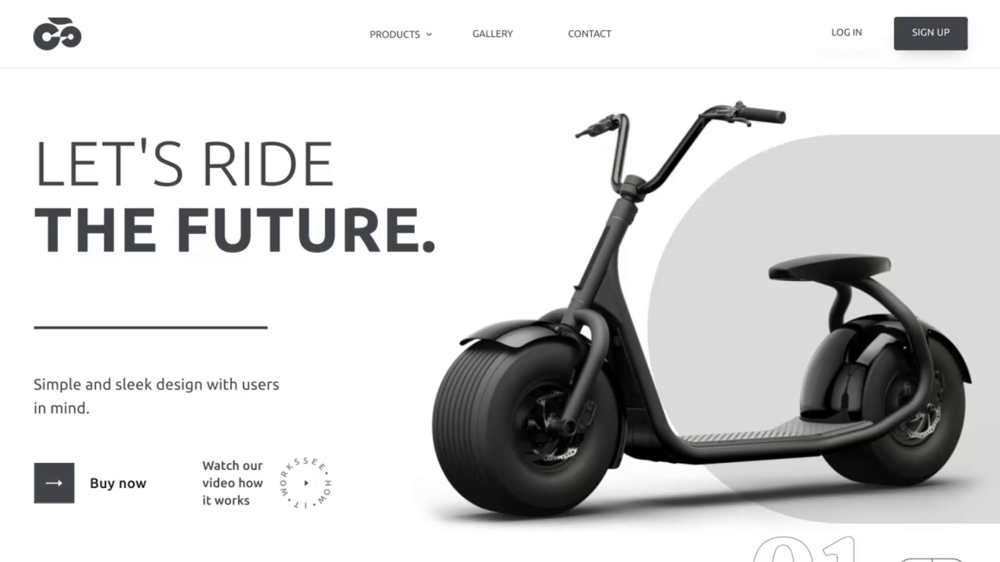

<p align="center">
  <a href="https://github.com/OleksandrZadvornyi/e-scooter-landing-page/graphs/contributors"></a>
  <a href="https://github.com/OleksandrZadvornyi/e-scooter-landing-page/network/members"></a>
  <a href="https://github.com/OleksandrZadvornyi/e-scooter-landing-page/stargazers"></a>
  <a href="https://github.com/OleksandrZadvornyi/e-scooter-landing-page/issues"></a>
  <a href="https://github.com/OleksandrZadvornyi/e-scooter-landing-page/blob/master/LICENSE"></a>
</p>

<br />
<div align="center">
  <a href="https://github.com/OleksandrZadvornyi/e-scooter-landing-page">
    
  </a>

<h3 align="center">E-Scooter Landing Page</h3>

  <p align="center">
    A modern, pixel-perfect landing page for an electric scooter brand.
    <br />
    <a href="https://github.com/OleksandrZadvornyi/e-scooter-landing-page"><strong>Explore the docs »</strong></a>
    <br />
    <br />
    <a href="https://e-scooters.netlify.app/">View Demo</a>
    ·
    <a href="https://github.com/OleksandrZadvornyi/e-scooter-landing-page/issues">Report Bug</a>
    ·
    <a href="https://github.com/OleksandrZadvornyi/e-scooter-landing-page/issues">Request Feature</a>
  </p>
  
  [](https://app.netlify.com/sites/e-learn-website/deploys)
</div>

## About The Project

<div align="center">
  <br/>
  <a href="https://e-scooters.netlify.app/"></a>
  <br/><br/>
</div>

**E-Scooters** is a single-page promotional website designed to showcase a modern electric scooter. This project demonstrates the conversion of a high-fidelity Figma design into a functional, responsive website using pure web technologies.

The layout includes a dynamic hero section, product specifications, accessory showcases, a photo gallery and a testimonial slider.

### Key Features
* **Responsive Design:** Fully fluid layout that works on desktop, tablet and mobile devices.
* **Modern CSS:** Utilizes CSS Flexbox for layout, CSS variables (`:root`) for color management and relative units (`clamp`, `%`) for typography and spacing.
* **Interactive Elements:** Includes hover states, buttons and navigation interactions.
* **Semantic HTML:** Structured using proper HTML5 tags (`<main>`, `<section>`, `<header>`, `<footer>`) for accessibility and SEO.

### Built With

* 
* 
* 
* [Font Awesome](https://fontawesome.com/) - For icons
* [Google Fonts](https://fonts.google.com/) - Using 'Ubuntu', 'Poppins' and 'Calistoga'

## Getting Started

To run this project locally, follow these simple steps.

1.  **Clone the repository**
    ```sh
    git clone https://github.com/OleksandrZadvornyi/e-scooter-landing-page.git
    ```
2.  **Navigate to the project directory**
    ```sh
    cd e-scooter-landing-page
    ```
3.  **Open the file**
    * Simply locate `index.html` in the folder and double-click to open it in your browser.
    * OR, if you use VS Code, use the "Live Server" extension to launch the site.

## Contributing

If you have suggestions for improvements, feel free to fork the repository and create a pull request. Any contributions you make are **greatly appreciated**. You can also open an issue with the tag "enhancement".

1. Fork the Project
2. Create your Feature Branch (`git checkout -b feature/AmazingFeature`)
3. Commit your Changes (`git commit -m 'Add some AmazingFeature'`)
4. Push to the Branch (`git push origin feature/AmazingFeature`)
5. Open a Pull Request

## Design Credit

This project is based on a design template by **Gautam Krishna** on [Figma](https://www.figma.com/).
* [View Original Design](https://www.figma.com/file/M9Icp6hKHqedepSQiiYeGW/E-Scooter-Landing-Page-(Community)?type=design&node-id=0-1&mode=design&t=BovQhjpitQh3Wq1Y-0)

## Contact

Oleksandr - [@telegram](https://t.me/oleksandr_zadvornyi) - zadvornyi.alex16@gmail.com

Project Link: [https://github.com/OleksandrZadvornyi/e-scooter-landing-page](https://github.com/OleksandrZadvornyi/e-scooter-landing-page)
